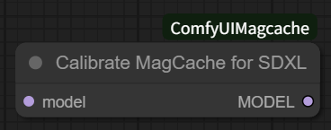
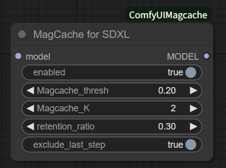

The original repository supporting multiple models can be found here

https://github.com/Zehong-Ma/ComfyUI-MagCache

This custom node is based on that code and is designed specifically for SDXL.

# ComfyUI-Magcache-for-SDXL

An experimental implementation of MagCache for SDXL

In my experiments, the WaveSpeed approach yielded better results than the this MagCache node for ComfyUI.

See also: https://github.com/chengzeyi/Comfy-WaveSpeed

## how to install

Place this repository in your ComfyUI custom nodes directory:

```
cd /path/to/ComfyUI/custom_nodes

git clone https://github.com/Shiba-2-shiba/ComfyUI-Magcache-for-SDXL.git

```
## Caliblate MagCache for SDXL Node



Add the Calibrate MagCache for SDXL node to your workflow.

Run the workflow to generate calibration data.

A JSON file will be created in the magcache_data folder—one file per model.

If you switch to a different sampler with the same model, delete the existing JSON file and run the calibration again.

If you use other sampler in same model, I suggest to delete the json file and regeneration new json file.

## MagCache for SDXL Node



Add the MagCache for SDXL node to your workflow.

This node will work only if a corresponding JSON file is present in the magcache_data folder.
